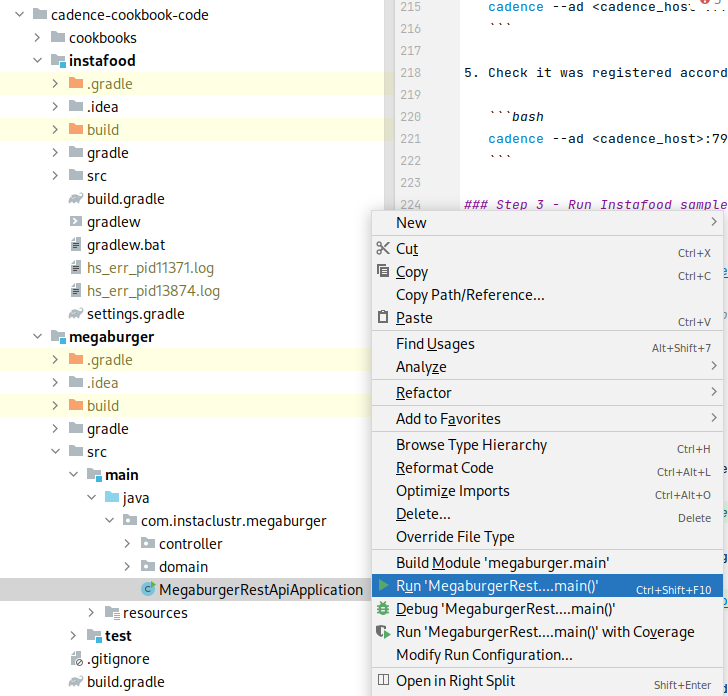

# Instafood: Cadence Polling External Services Cookbook


## Introduction

### Who is this cookbook for?

This cookbook is for developers and engineers of all levels looking to understand how child workflows work in Cadence. The
recipe in this book provides *"Hello World!"* type examples based on simple scenarios and use cases.

### What you will learn

How to setup a simple Cadence application which implements child workflows on Instaclustr's Managed Service Platform.

### What you will need

- An account on Instaclustr’s managed service platform (sign up for a free trial using the
  following [signup link](https://console2.instaclustr.com/signup))
- Basic Java 11 and Gradle installation
- IntelliJ Community Edition (or any other IDE with Gradle support)
- Docker (optional: only needed to run Cadence command line client)

### What is Cadence?

A large number of use cases span beyond a single request-reply, require tracking of a complex state, respond to asynchronous events, and communicate to external unreliable dependencies. The usual approach to building such applications is a hodgepodge of stateless services, databases, cron jobs, and queuing systems. This negatively impacts developer productivity as most of the code is dedicated to plumbing, obscuring the actual business logic behind a myriad of low-level details.

Cadence is an orchestration framework that helps developers write fault-tolerant, long-running applications, also known as workflows. In essence, it provides a durable virtual memory that is not linked to a specific process, and preserves the full application state, including function stacks, with local variables across all sorts of host and software failures. This allows you to write code using the full power of a programming language while Cadence takes care of durability, availability, and scalability of the application.

### What are child workflows?

Cadence's core abstraction is a fault-oblivious stateful **workflow**. A workflow may start other workflows and wait for them to complete, either synchronously or asynchronously. These are known as **child workflows**, and are a powerful tool which enable developers to coordinate large and complex tasks within the Cadence framework.

Child workflows may be developed over time, such as when two existing workflow processes are joined, or designed from the start to take advantage the features available in Cadence.


*Fig 1. Flow diagram for a child workflow process*

What are the advantages of child workflows?

Child workflows have similar functionality as **activities**. An activity is business-level function that implements application logic such as calling a service or transcoding a media file. 
The parent workflow can monitor the child worflow and track its progress. It can also signal the child workflow, passing information to it from the primary workflow.

Child workflows can be implemented by separate **worker processes**. A worker process is the process which is invoked to execute a particular workflow. 
Separating out a set of activities into a child workflow allows you to ensure the code that gets executed the most has the most resources by scaling those workers appropriately. 

Another advantage of using child workflows is to work around the built in Cadence limits. There are limits for the number of activities a single workflow can execute. These limits exist due to the way the workflow state is persisted in the backend and they were developed to ensure the most efficient operation of a Cadence cluster.
For workflows running a high number of activities, we can use child workflows to distribute the work, essentially removing the limit while also gaining the aformentioned scalability.

When should I use a child workflow?

In many ways, the answer to this question is similar to "when should I extract this code into a function?". If you find your workflows calling the same set of activities it is a prime candidate to be invoked via child workflow.

If your workflow is approaching the limit of activity invocations, using child workflows is required to avoid running into the limits mentioned above.

Finally, child workflows are a great way to set boundries between areas of functionality. Keeping all the code related to a specific functional area or responsibility makes them more reusable. We will see an example of this in the following cookbook, where we use child workflows to encapsulate the workflows of different restaurants and delivery processes.

### Invoking a child workflow

The code to invoke a child workflow is almost identical to invoking a regular workflow:
```java
    // We first create a stub for the child workflow and include a set of options
    SubWorkflow child = Workflow.newChildWorkflowStub(SubWorkflow.class, options);

    // Asynchronous
    // Then we call the function to start it 
    // This is a non blocking call that returns immediately.
    Promise<String> result = Async.function(child::doWork);

    // Or synchronous
    // Block until the child workflow completes
    child.doWork();
```

We start by creating a **child workflow stub**. When we create this stub we can optionally pass it some **child workflow options**, which allow you to change the rules of how this child workflow executes compared to its parent.
Some of the options we can change are the domain, tasklist, timeout settings, retry settings and more. If we choose to omit this value, the child workflow will inherit these settings from its parent.

The workflow stub has the methods to start the workflow, and they can be invoked in two ways:
1. Asynchronously - This returns a promise object, a future which will be used to store the result of the child workflow after it has completed. After making this call, the workflow code will continue and the child workflow will execute in parallel.
2. Synchronously - This will block like a regular function call and is invoked as such. The parent workflow won't continue until the child workflow has completed.

### Child workflow limitations
Since workflows are the main building block of Cadence, there are very few limitations to child workflows. 

The main one is that there is no shared state between the parent and child workflows. Asynchronous communication can be built between the workflow instances, but if there is constant communication of state going back and forth, its probably a better candidate as a single workflow..

## Use Case Example: Instafood meets MegaBurgers

In order to see this pattern in action, we'll create some child workflows in our sample project.

### Instafood Brief

Instafood is an online app-based meal delivery service. Customers can place an order for food from their favorite local restaurants via Instafood’s mobile app. Orders can be for pickup or delivery. If delivery is chosen, Instafood will organize to have one of their many delivery drivers pickup the order from the restaurant and deliver it to the customer. Instafood provides each restaurant a kiosk/tablet which is used for communication between Instafood and the restaurant. Instafood notifies the restaurant when an order is placed, and then the restaurant can accept the order, provide an ETA, mark it as ready, etc. For delivery orders, Instafood will coordinate to have a delivery driver pick up based on the ETA.

### Ordering from "MegaBurgers"

MegaBurgers is a large multinational fast food hamburger chain. They have an existing mobile app and website that uses a back-end REST API for customers to place orders. Instafood’s backend will directly integrate with MegaBurgers’s existing REST-based ordering system to place orders and receive updates.


*Fig 3. MegaBurger's order state machine*

We are building Instafood to offer meals from any restaurant that signs up. Each company will have its own method to make orders and check on the progress, which makes it a perfect candidate to implement via a child workflow.

In the case of MegaBurger, this is done via a simple **if** statment which is made at the time of ordering.

``` java
  if (Restaurant.MEGABURGER.equals(order.getRestaurant())) {
      MegaBurgerOrderWorkflow megaBurgerOrderWorkflow = Workflow.newChildWorkflowStub(MegaBurgerOrderWorkflow.class);
      Async.procedure(megaBurgerOrderWorkflow::orderFood, order);
  }
```
The above example shows how simple this makes the parent workflow, it doesn't have to know about the various peculiarities of each companies order process, thats the job of the child workflow to determine.

## Setting up Instafood Project

In order to run the sample project by yourself you’ll need to set up a Cadence cluster. We’ll be using Instaclustr’s Managed Service platform to do so.

### Step 1 - Creating Instaclustr Managed Clusters

A Cadence cluster requires an Apache Cassandra® cluster to connect to for its persistence layer. In order to set up both Cadence and Cassandra clusters we’ll follow ["Creating a Cadence Cluster" documentation.](https://www.instaclustr.com/support/documentation/cadence/getting-started-with-cadence/creating-a-cadence-cluster/)

By using Instaclustr platform, the following operations are handled automatically for you:

- Firewall rules will automatically get configured on the Cassandra cluster for Cadence nodes.
- Authentication between Cadence and Cassandra will get configured, including client encryption settings.
- The Cadence default and visibility keyspaces will be created automatically in Cassandra.
- A link will be created between the two clusters, ensuring you don’t accidentally delete the Cassandra cluster before
  Cadence.
- A Load Balancer will be created. It is recommended to use the load balancer address to connect to your cluster.


### Step 2 - Setting up Cadence Domain

Cadence is backed by a multi-tenant service where the unit of isolation is called a domain. In order
to get our Instafood application running we first need to register a domain for it.

1. In order to interact with our Cadence cluster, we need to install its command line interface client.

   #### macOS
   If using a macOS client the Cadence CLI can be installed with Homebrew as follows:
    ```bash
    brew install cadence-workflow
    # run command line client
    cadence <command> <arguments>
    ```

   #### Other Systems
   If not, the CLI can be used via Docker Hub image `ubercadence/cli`:
    ```bash
    # run command line client
    docker run --network=host --rm ubercadence/cli:master <command> <arguments>
    ```

   For the rest of the steps we'll use `cadence` to refer to the client.

2. In order to connect, it is recommended to use the load balancer address to connect to your cluster. This can be found at the top of the
   *Connection Info* tab, and will look like this: "ab-cd12ef23-45gh-4baf-ad99-df4xy-azba45bc0c8da111.elb.us-east-1.amazonaws.com". We'll call this the <cadence_host>.


3. We can now test our connection by listing current domains:

   ```bash
   cadence --ad <cadence_host>:7933 admin domain list
   ```

4. Add `instafood` domain:

   ```bash
   cadence --ad <cadence_host>:7933 --do instafood domain register --global_domain=false
   ```

5. Check it was registered accordingly:

   ```bash
   cadence --ad <cadence_host>:7933 --do instafood domain describe
   ```

### Step 3 - Run Instafood Sample Project

1. Clone Gradle project
   from [Instafood project git repository](https://github.com/instaclustr/cadence-cookbooks-instafood).

2. Open property file at `instafood/src/main/resources/instafood.properties` and replace `cadenceHost` value with your
   load balancer address:

   ```properties
   cadenceHost=<cadence_host>
   ```

3. You can now run the app by  
   ```bash
   cadence-cookbooks-instafood/instafood$ ./gradlew run
   ```
   or executing *InstafoodApplication* main class from your IDE:

   

4. Check it is running by looking into its terminal output:

   

## Looking Into MegaBurger's API

Before looking into how Instafood integrates with MegaBurger lets first have a quick look into their API.

### Run MegaBurger Server

Let's start by running the server. This can be accomplished by running
  ```bash
  cadence-cookbooks-instafood/megaburger$ ./gradlew run
  ```

or *MegaburgerRestApplication* from your IDE:



This is a simple Spring Boot Rest API with an in-memory persistence layer intended for demo purposes. All data is lost
when the application closes.

### MegaBurger's Orders API

MegaBurger exposes its `Orders API` in order to track and update the state of each food order.

#### POST /orders

Creates an `Order` and returns its `id`

**Request:**

```bash
curl -X POST localhost:8080/orders -H "Content-Type: application/json" --data '{"meal": "Vegan Burger", "quantity": 1}'
```

**Response:**

```json
{
  "id": 1,
  "meal": "Vegan Burger",
  "quantity": 1,
  "status": "PENDING",
  "eta_minutes": null
}
```

#### GET /orders

Returns a list with all `Orders`.

**Request:**

```bash
curl -X GET localhost:8080/orders
```

**Response:**

```json
[
  {
    "id": 0,
    "meal": "Vegan Burger",
    "quantity": 1,
    "status": "PENDING",
    "eta_minutes": null
  },
  {
    "id": 1,
    "meal": "Onion Rings",
    "quantity": 2,
    "status": "PENDING",
    "eta_minutes": null
  }
]
```

#### GET /orders/{orderId}

Returns `Order` with `id` equal to `orderId`.

**Request:**

```bash
curl -X GET localhost:8080/orders/1
```

**Response:**

```json
{
  "id": 1,
  "meal": "Onion Rings",
  "quantity": 2,
  "status": "PENDING",
  "eta_minutes": null
}
```

#### PATCH /orders/{orderId}

Updates `Order` with `id` equal to `orderId`.

**Request:**

```bash
curl -X PATCH localhost:8080/orders/1 -H "Content-Type: application/json" --data '{"status": "ACCEPTED"}'
```

**Response:**

```json
{
  "id": 1,
  "meal": "Onion Rings",
  "quantity": 2,
  "status": "ACCEPTED",
  "eta_minutes": null
}
```

## Megaburger Polling Integration Review

Now that we have everything set up, lets look at the actual integration between Instafood and Megaburger.

### Polling Workflow

We begin by defining a new **workflow**, *MegaBurgerOrderWorkflow*:

```java
public interface MegaBurgerOrderWorkflow {

    @WorkflowMethod
    void orderFood(FoodOrder order);

    // ...
}
```

This workflow has an `orderFood` method which will send and track the corresponding `FoodOrder` by integrating with
MegaBurger.

Lets look at its implementation:

```java
public class MegaBurgerOrderWorkflowImpl implements MegaBurgerOrderWorkflow {

    // ...

    @Override
    public void orderFood(FoodOrder order) {
        OrderWorkflow parentOrderWorkflow = getParentOrderWorkflow();

        Integer orderId = megaBurgerOrderActivities.createOrder(mapMegaBurgerFoodOrder(order));
        updateOrderStatus(parentOrderWorkflow, OrderStatus.PENDING);

        // Poll until Order is accepted/rejected
        updateOrderStatus(parentOrderWorkflow, pollOrderStatusTransition(orderId, OrderStatus.PENDING));

        if (OrderStatus.REJECTED.equals(currentStatus)) {
            throw new RuntimeException("Order with id " + orderId + " was rejected");
        }
        // Send ETA to parent workflow
        parentOrderWorkflow.updateEta(getOrderEta(orderId));

        // Poll until Order is cooking
        updateOrderStatus(parentOrderWorkflow, pollOrderStatusTransition(orderId, OrderStatus.ACCEPTED));
        // Poll until Order is ready
        updateOrderStatus(parentOrderWorkflow, pollOrderStatusTransition(orderId, OrderStatus.COOKING));
        // Poll until Order is delivered
        updateOrderStatus(parentOrderWorkflow, pollOrderStatusTransition(orderId, OrderStatus.READY));
    }

    // ...
}
```

The workflow starts by obtaining its parent workflow. Our *MegaBurgerOrderWorkflow* only handles the integration with MegaBurger, getting the order delivered to the client is managed by a separate workflow; this means we are working with a **child workflow**.

We then create the order through an activity and obtain an order `id`. This activity is just a wrapper for an API
client which performs the **POST** to `/orders`.

After creating the order, the parent workflow is notified by a **signal** (an external asynchronous request to a
workflow) that the order is now `PENDING`.

Now we must wait until the order transitions from `PENDING` to either `ACCEPTED` or `REJECTED`. This is where polling
comes into play; lets look at what our function `pollOrderStatusTransition` does:
```java
  private OrderStatus pollOrderStatusTransition(Integer orderId, OrderStatus orderStatus) {
        OrderStatus polledStatus = megaBurgerOrderActivities.getOrderById(orderId).getStatus();
        while (orderStatus.equals(polledStatus)) {
            Workflow.sleep(Duration.ofSeconds(30));
            polledStatus = megaBurgerOrderActivities.getOrderById(orderId).getStatus();
        }
        return polledStatus;
  }
```

This is very similar to the polling loop we presented in the introduction of this article. The only difference being instead of waiting for a specific state it polls until there is a transition. Once again, the actual API call used to get an order by id is hidden behind an activity which has retries enabled.

If the order is rejected, a runtime exception is thrown failing the workflow. If it is accepted, the parent is notified of MegaBurger’s ETA (this is used by the parent workflow to estimate delivery dispatching).

Finally, each of the remaining states shown in *Fig 3* is transitioned, until the order is marked as delivered.

### Running a Happy-Path Scenario

To wrap-up, let’s run a whole order scenario. This scenario is part of the test suite included with our sample project. The only requirement is running both Instafood and MegaBurger server as described in the previous steps. This test case describes a client ordering through Instafood MegaBurger’s new *Vegan Burger* for pick-up:

Let's start by running the server. This can be accomplished by running
  ```bash
  cadence-cookbooks-instafood/instafood$ ./gradlew test
  ```

or *InstafoodApplicationTest* from your IDE

```java
class InstafoodApplicationTest {

    // ...

    @Test
    public void givenAnOrderItShouldBeSentToMegaBurgerAndBeDeliveredAccordingly() {
        FoodOrder order = new FoodOrder(Restaurant.MEGABURGER, "Vegan Burger", 2, "+54 11 2343-2324", "Díaz velez 433, La lucila", true);

        // Client orders food
        WorkflowExecution workflowExecution = WorkflowClient.start(orderWorkflow::orderFood, order);

        // Wait until order is pending Megaburger's acceptance
        await().until(() -> OrderStatus.PENDING.equals(orderWorkflow.getStatus()));

        // Megaburger accepts order and sends ETA
        megaBurgerOrdersApiClient.updateStatusAndEta(getLastOrderId(), "ACCEPTED", 15);
        await().until(() -> OrderStatus.ACCEPTED.equals(orderWorkflow.getStatus()));

        // Megaburger starts cooking order
        megaBurgerOrdersApiClient.updateStatus(getLastOrderId(), "COOKING");
        await().until(() -> OrderStatus.COOKING.equals(orderWorkflow.getStatus()));

        // Megaburger signals order is ready
        megaBurgerOrdersApiClient.updateStatus(getLastOrderId(), "READY");
        await().until(() -> OrderStatus.READY.equals(orderWorkflow.getStatus()));

        // Megaburger signals order has been picked-up
        megaBurgerOrdersApiClient.updateStatus(getLastOrderId(), "RESTAURANT_DELIVERED");
        await().until(() -> OrderStatus.RESTAURANT_DELIVERED.equals(orderWorkflow.getStatus()));

        await().until(() -> workflowHistoryHasEvent(workflowClient, workflowExecution, EventType.WorkflowExecutionCompleted));
    }
}
```

We have 3 actors in this scenario: Instafood, MegaBurger and the Client.

1. The Client sends order to Instafood.
2. Once the order reaches MegaBurger (order status is `PENDING`), MegaBurgers marks it as `ACCEPTED` and sends an ETA.
3. We then have the whole sequence of status updates:
   1. MegaBurger marks order as `COOKING`.
   2. MegaBurger marks order as `READY` (this means it's ready for delivery/pickup).
   3. MegaBurger marks order as `RESTAURANT_DELIVERD`.
4. Since this was an order created as pickup, once the Client has done so the workflow is complete.

## Wrapping Up

In this article we got first-hand experience with Cadence and how to use it for polling. We also showed you how to get a Cadence cluster running with our Instaclustr platform and how easy it is to get an application connect to it. If you’re interested in Cadence and want to learn more about it, you may read about other use cases and documentation at [Cadence workflow - Use cases](https://cadenceworkflow.io/docs/use-cases/).
