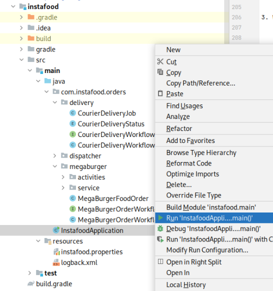

# Instafood: Cadence Polling External Services Cookbook


## Introduction

### Who is this cookbook for?

This cookbook is for developers and engineers of all levels looking to understand how polling works in Cadence. The
recipe in this book provides *"Hello World!"* type examples based on simple scenarios and use cases.

### What you will learn

How to setup a simple Cadence polling application on Instaclustr's Managed Service Platform.

### What you will need

- An account on Instaclustr’s managed service platform (sign up for a free trial using the
  following [signup link](https://console2.instaclustr.com/signup))
- Basic Java 11 and Gradle installation
- IntelliJ Community Edition (or any other IDE with Gradle support)
- Docker (optional: only needed to run Cadence command line client)

### What is Cadence?

A large number of use cases span beyond a single request-reply, require tracking of a complex state, respond to asynchronous events, and communicate to external unreliable dependencies. The usual approach to building such applications is a hodgepodge of stateless services, databases, cron jobs, and queuing systems. This negatively impacts developer productivity as most of the code is dedicated to plumbing, obscuring the actual business logic behind a myriad of low-level details.

Cadence is an orchestration framework that helps developers write fault-tolerant, long-running applications, also known as workflows. In essence, it provides a durable virtual memory that is not linked to a specific process, and preserves the full application state, including function stacks, with local variables across all sorts of host and software failures. This allows you to write code using the full power of a programming language while Cadence takes care of durability, availability, and scalability of the application.

### What is Polling?

Polling is executing a periodic action to check for state change. Examples are pinging a host, calling a REST API, or
listing a storage bucket for newly uploaded files.


*Fig 1. Flow diagram for a polling process*

Polling should be avoided where possible (favoring instead an event triggered interrupt), as busy waiting typically eats a lot of CPU cycles unnecessarily (unless either (a) you are only going to poll for a short time, or (b) you can afford to sleep for a reasonable time in your polling loop). It is to a computer the equivalent of asking every 5’ how far are you from your destination on a long trip:


*Are We There Yet?*
*Kids have a pretty solid polling mechanism! (Source: Shutterstock)*

Nonetheless, there are times were it’s the only option available. Cadence support for durable timers, long running activities and unlimited retries makes it a good fit.

## Polling External Services with Cadence

There are several ways to implement a polling mechanism. We will focus on polling external services and how we can benefit from Cadence in doing so.

To begin with, let’s briefly explain some Cadence concepts. Cadence core abstraction is a fault- oblivious stateful **workflow**. What that means is that the state of the workflow code, including local variables and any threads it creates, is immune to process and Cadence service failures. This is a very powerful concept as it encapsulates state, processing threads, durable timers, and event handlers.

In order to fulfill deterministic execution requirements, workflows are not allowed to call any external API directly. Instead they orchestrate execution of **activities**. An activity is business-level function that implements application logic such as calling a service or transcoding a media file. Cadence does not recover activity state in case of failures, therefore an activity function is allowed to contain any code without restrictions.

### Writing our Polling Loop

The code itself is pretty simple—we’ll go line by line explaining what each thing does:
```java
    State polledState = externalServiceActivities.getState();
    while (!expectedState.equals(polledState)) {
        Workflow.sleep(Duration.ofSeconds(30));
        polledState = externalServiceActivities.getState();
    }
    // We've reached our expected state!
```

We start by calling an **activity**, in this case an external service which could be a REST API. We then have our condition, matching our diamond in Fig 1. If the desired state hasn’t been reached yet, we schedule a sleep of 30 seconds. This isn’t any kind of sleep, it’s a **durable timer**. In this case our polling waits for a brief period of time but it could be longer, and in those cases you wouldn’t want to wait the whole interval if your execution were to fail.

Cadence solves this by persisting timers as events and alerting the corresponding **worker** (service that hosts the workflow and activity implementations) once it has completed. These timers can manage intervals going from seconds to minutes, hours, days, and even months or years!


*10, 9, 8, 7....Rocket launch into space-now that's a timer you can trust (Source: Shutterstock)*

Finally we refresh our state by calling again our external service. As easy as that!

Before we continue, let’s take a quick look at what Cadence is actually doing behind the scenes in order to avoid potential issues.

### IMPORTANT: Cadence History and Polling Caveats

How does Cadence achieve fault-oblivious stateful workflows? The secret lies in how Cadence persists workflow execution. The workflow state recovery utilizes **event sourcing** which puts a few restrictions on how the code is written. Event sourcing persists state as a sequence of state-changing events. Whenever the state of our workflow changes, a new event is appended to its history of events. Cadence then reconstructs a workflow’s current state by replaying the events.

That is why all communication with the external world should happen through activities and Cadence APIs must be used to get current time, sleep, and create new threads.

#### Why Be Careful When Polling?

Polling requires looping over a condition over and over again. Since each activity call and timer event is persisted you may imagine how a short polling interval can result in a huge timeline. Let’s study how our polling snippet’s history could look like.

1. We start by scheduling the activity needed to poll our external service.
2. The activity is started by a worker.
3. The activity completes and returns its result.
4. Condition is not met yet, so a timer is started.
5. Once time passes, an event is triggered to wake up the workflow.
6. Steps 1 to 5 are repeated until the condition is met.
7. Final poll confirms condition is met (no need to set timer).
8. Workflow is marked as complete.


*Fig 2. Cadence history of events for our polling snippet code*

If the workflow were to fail somewhere in the middle and its history had to be replayed this could result in going through a huge list of events. There are several ways to keep it under control: avoid using short polling periods, set reasonable timeouts on your workflows, limit polling to a certain number of polls.

**Bottomline:** remember all actions are persisted and may need to be replayed by workers.

### Setting up Activity Retries

What happens if our external service fails for some reason? We need to try, try, try again!

We briefly mentioned how Cadence uses activities for non-deterministic where something may fail unexpectedly like consuming an API. This allows Cadence to record activity results and be able to resume workflows seamlessly while also adding support for extra functionality like retry logic.

Below is an example of activity configuration with retry options enabled:

```java
private final ExternalServiceActivities externalServiceActivities =
    Workflow.newActivityStub(ExternalServiceActivities.class,
        new ActivityOptions.Builder()
            .setRetryOptions(new RetryOptions.Builder()
                .setInitialInterval(Duration.ofSeconds(10))
                .setMaximumAttempts(3)
                .build())
            .setScheduleToCloseTimeout(Duration.ofMinutes(5))
            .build());
```

By doing so, we tell Cadence actions present in `ExternalServiceActivities` should retry at most 3 times with an interval of 30 seconds between each try. In doing so, each call to an external service activity will be transparently retried without the need to write any retry logic.

## Use Case Example: Instafood meets MegaBurgers

In order to see this pattern in action, we'll go through a fictional polling integration on our sample project.

### Instafood Brief

Instafood is an online app-based meal delivery service. Customers can place an order for food from their favorite local restaurants via Instafood’s mobile app. Orders can be for pickup or delivery. If delivery is chosen, Instafood will organize to have one of their many delivery drivers pickup the order from the restaurant and deliver it to the customer. Instafood provides each restaurant a kiosk/tablet which is used for communication between Instafood and the restaurant. Instafood notifies the restaurant when an order is placed, and then the restaurant can accept the order, provide an ETA, mark it as ready, etc. For delivery orders, Instafood will coordinate to have a delivery driver pick up based on the ETA.

### Polling "MegaBurgers"

MegaBurgers is a large multinational fast food hamburger chain. They have an existing mobile app and website that uses a back-end REST API for customers to place orders. Instafood and MegaBurgers have come to an agreement where Instafood customers can place MegaBurger orders through the Instafood app for pickup and delivery. Instead of installing Instafood kiosks at all MegaBurger locations, it has been agreed that Instafood’s backend order workflow system will special-case MegaBurgers, and will directly integrate with MegaBurgers’s existing REST-based ordering system to place orders and receive updates.


*Fig 3. MegaBurger's order state machine*

The MegaBurger’s REST API has no push style mechanism (websockets, web hooks, etc.) to receive order status updates. Instead periodic GET requests need to be made to determine order status, and the result of these polls may cause the order workflow to progress on the Instafood side (such as scheduling a delivery driver for pickup).

## Setting up Instafood Project

In order to run the sample project by yourself you’ll need to set up a Cadence cluster. We’ll be using Instaclustr’s Managed Service platform to do so.

### Step 1 - Creating Instaclustr Managed Clusters

A Cadence cluster requires an Apache Cassandra® cluster to connect to for its persistence layer. In order to set up both Cadence and Cassandra clusters we’ll follow ["Creating a Cadence Cluster" documentation.](https://www.instaclustr.com/support/documentation/cadence/getting-started-with-cadence/creating-a-cadence-cluster/)

By using Instaclustr platform, the following operations are handled automatically for you:

- Firewall rules will automatically get configured on the Cassandra cluster for Cadence nodes.
- Authentication between Cadence and Cassandra will get configured, including client encryption settings.
- The Cadence default and visibility keyspaces will be created automatically in Cassandra.
- A link will be created between the two clusters, ensuring you don’t accidentally delete the Cassandra cluster before
  Cadence.
- A Load Balancer will be created. It is recommended to use the load balancer address to connect to your cluster.


### Step 2 - Setting up Cadence Domain

Cadence is backed by a multi-tenant service where the unit of isolation is called a domain. In order
to get our Instafood application running we first need to register a domain for it.

1. In order to interact with our Cadence cluster, we need to install its command line interface client.

   #### macOS
   If using a macOS client the Cadence CLI can be installed with Homebrew as follows:
    ```bash
    brew install cadence-workflow
    # run command line client
    cadence <command> <arguments>
    ```

   #### Other Systems
   If not, the CLI can be used via Docker Hub image `ubercadence/cli`:
    ```bash
    # run command line client
    docker run --network=host --rm ubercadence/cli:master <command> <arguments>
    ```

   For the rest of the steps we'll use `cadence` to refer to the client.

2. In order to connect, it is recommended to use the load balancer address to connect to your cluster. This can be found at the top of the
   *Connection Info* tab, and will look like this: "ab-cd12ef23-45gh-4baf-ad99-df4xy-azba45bc0c8da111.elb.us-east-1.amazonaws.com". We'll call this the <cadence_host>.


3. We can now test our connection by listing current domains:

   ```bash
   cadence --ad <cadence_host>:7933 admin domain list
   ```

4. Add `instafood` domain:

   ```bash
   cadence --ad <cadence_host>:7933 --do instafood domain register --global_domain=false
   ```

5. Check it was registered accordingly:

   ```bash
   cadence --ad <cadence_host>:7933 --do instafood domain describe
   ```

### Step 3 - Run Instafood Sample Project

1. Clone Gradle project
   from [Instafood project git repository](https://github.com/instaclustr/cadence-cookbooks-instafood).

2. Open property file at `instafood/src/main/resources/instafood.properties` and replace `cadenceHost` value with your
   load balancer address:

   ```properties
   cadenceHost=<cadence_host>
   ```

3. You can now run the app by  
   ```bash
   cadence-cookbooks-instafood/instafood$ ./gradlew run
   ```
   or executing *InstafoodApplication* main class from your IDE:

   

4. Check it is running by looking into its terminal output:

   

## Looking Into MegaBurger's API

Before looking into how Instafood integrates with MegaBurger lets first have a quick look into their API.

### Run MegaBurger Server

Let's start by running the server. This can be accomplished by running
  ```bash
  cadence-cookbooks-instafood/megaburger$ ./gradlew run
  ```

or *MegaburgerRestApplication* from your IDE:


This is a simple Spring Boot Rest API with an in-memory persistence layer intended for demo purposes. All data is lost
when the application closes.

### MegaBurger's Orders API

MegaBurger exposes its `Orders API` in order to track and update the state of each food order.

#### POST /orders

Creates an `Order` and returns its `id`

**Request:**

```bash
curl -X POST localhost:8080/orders -H "Content-Type: application/json" --data '{"meal": "Vegan Burger", "quantity": 1}'
```

**Response:**

```json
{
  "id": 1,
  "meal": "Vegan Burger",
  "quantity": 1,
  "status": "PENDING",
  "eta_minutes": null
}
```

#### GET /orders

Returns a list with all `Orders`.

**Request:**

```bash
curl -X GET localhost:8080/orders
```

**Response:**

```json
[
  {
    "id": 0,
    "meal": "Vegan Burger",
    "quantity": 1,
    "status": "PENDING",
    "eta_minutes": null
  },
  {
    "id": 1,
    "meal": "Onion Rings",
    "quantity": 2,
    "status": "PENDING",
    "eta_minutes": null
  }
]
```

#### GET /orders/{orderId}

Returns `Order` with `id` equal to `orderId`.

**Request:**

```bash
curl -X GET localhost:8080/orders/1
```

**Response:**

```json
{
  "id": 1,
  "meal": "Onion Rings",
  "quantity": 2,
  "status": "PENDING",
  "eta_minutes": null
}
```

#### PATCH /orders/{orderId}

Updates `Order` with `id` equal to `orderId`.

**Request:**

```bash
curl -X PATCH localhost:8080/orders/1 -H "Content-Type: application/json" --data '{"status": "ACCEPTED"}'
```

**Response:**

```json
{
  "id": 1,
  "meal": "Onion Rings",
  "quantity": 2,
  "status": "ACCEPTED",
  "eta_minutes": null
}
```

## Megaburger Polling Integration Review

Now that we have everything set up, lets look at the actual integration between Instafood and Megaburger.

### Polling Workflow

We begin by defining a new **workflow**, *MegaBurgerOrderWorkflow*:

```java
public interface MegaBurgerOrderWorkflow {

    @WorkflowMethod
    void orderFood(FoodOrder order);

    // ...
}
```

This workflow has an `orderFood` method which will send and track the corresponding `FoodOrder` by integrating with
MegaBurger.

Lets look at its implementation:

```java
public class MegaBurgerOrderWorkflowImpl implements MegaBurgerOrderWorkflow {

    // ...

    @Override
    public void orderFood(FoodOrder order) {
        OrderWorkflow parentOrderWorkflow = getParentOrderWorkflow();

        Integer orderId = megaBurgerOrderActivities.createOrder(mapMegaBurgerFoodOrder(order));
        updateOrderStatus(parentOrderWorkflow, OrderStatus.PENDING);

        // Poll until Order is accepted/rejected
        updateOrderStatus(parentOrderWorkflow, pollOrderStatusTransition(orderId, OrderStatus.PENDING));

        if (OrderStatus.REJECTED.equals(currentStatus)) {
            throw new RuntimeException("Order with id " + orderId + " was rejected");
        }
        // Send ETA to parent workflow
        parentOrderWorkflow.updateEta(getOrderEta(orderId));

        // Poll until Order is cooking
        updateOrderStatus(parentOrderWorkflow, pollOrderStatusTransition(orderId, OrderStatus.ACCEPTED));
        // Poll until Order is ready
        updateOrderStatus(parentOrderWorkflow, pollOrderStatusTransition(orderId, OrderStatus.COOKING));
        // Poll until Order is delivered
        updateOrderStatus(parentOrderWorkflow, pollOrderStatusTransition(orderId, OrderStatus.READY));
    }

    // ...
}
```

The workflow starts by obtaining its parent workflow. Our *MegaBurgerOrderWorkflow* only handles the integration with MegaBurger, getting the order delivered to the client is managed by a separate workflow; this means we are working with a **child workflow**.

We then create the order through an activity and obtain an order `id`. This activity is just a wrapper for an API
client which performs the **POST** to `/orders`.

After creating the order, the parent workflow is notified by a **signal** (an external asynchronous request to a
workflow) that the order is now `PENDING`.

Now we must wait until the order transitions from `PENDING` to either `ACCEPTED` or `REJECTED`. This is where polling
comes into play; lets look at what our function `pollOrderStatusTransition` does:
```java
  private OrderStatus pollOrderStatusTransition(Integer orderId, OrderStatus orderStatus) {
        OrderStatus polledStatus = megaBurgerOrderActivities.getOrderById(orderId).getStatus();
        while (orderStatus.equals(polledStatus)) {
            Workflow.sleep(Duration.ofSeconds(30));
            polledStatus = megaBurgerOrderActivities.getOrderById(orderId).getStatus();
        }
        return polledStatus;
  }
```

This is very similar to the polling loop we presented in the introduction of this article. The only difference being instead of waiting for a specific state it polls until there is a transition. Once again, the actual API call used to get an order by id is hidden behind an activity which has retries enabled.

If the order is rejected, a runtime exception is thrown failing the workflow. If it is accepted, the parent is notified of MegaBurger’s ETA (this is used by the parent workflow to estimate delivery dispatching).

Finally, each of the remaining states shown in *Fig 3* is transitioned, until the order is marked as delivered.

### Running a Happy-Path Scenario

To wrap-up, let’s run a whole order scenario. This scenario is part of the test suite included with our sample project. The only requirement is running both Instafood and MegaBurger server as described in the previous steps. This test case describes a client ordering through Instafood MegaBurger’s new *Vegan Burger* for pick-up:

Let's start by running the server. This can be accomplished by running
  ```bash
  cadence-cookbooks-instafood/instafood$ ./gradlew test
  ```

or *InstafoodApplicationTest* from your IDE

```java
class InstafoodApplicationTest {

    // ...

    @Test
    public void givenAnOrderItShouldBeSentToMegaBurgerAndBeDeliveredAccordingly() {
        FoodOrder order = new FoodOrder(Restaurant.MEGABURGER, "Vegan Burger", 2, "+54 11 2343-2324", "Díaz velez 433, La lucila", true);

        // Client orders food
        WorkflowExecution workflowExecution = WorkflowClient.start(orderWorkflow::orderFood, order);

        // Wait until order is pending Megaburger's acceptance
        await().until(() -> OrderStatus.PENDING.equals(orderWorkflow.getStatus()));

        // Megaburger accepts order and sends ETA
        megaBurgerOrdersApiClient.updateStatusAndEta(getLastOrderId(), "ACCEPTED", 15);
        await().until(() -> OrderStatus.ACCEPTED.equals(orderWorkflow.getStatus()));

        // Megaburger starts cooking order
        megaBurgerOrdersApiClient.updateStatus(getLastOrderId(), "COOKING");
        await().until(() -> OrderStatus.COOKING.equals(orderWorkflow.getStatus()));

        // Megaburger signals order is ready
        megaBurgerOrdersApiClient.updateStatus(getLastOrderId(), "READY");
        await().until(() -> OrderStatus.READY.equals(orderWorkflow.getStatus()));

        // Megaburger signals order has been picked-up
        megaBurgerOrdersApiClient.updateStatus(getLastOrderId(), "RESTAURANT_DELIVERED");
        await().until(() -> OrderStatus.RESTAURANT_DELIVERED.equals(orderWorkflow.getStatus()));

        await().until(() -> workflowHistoryHasEvent(workflowClient, workflowExecution, EventType.WorkflowExecutionCompleted));
    }
}
```

We have 3 actors in this scenario: Instafood, MegaBurger and the Client.

1. The Client sends order to Instafood.
2. Once the order reaches MegaBurger (order status is `PENDING`), MegaBurgers marks it as `ACCEPTED` and sends an ETA.
3. We then have the whole sequence of status updates:
   1. MegaBurger marks order as `COOKING`.
   2. MegaBurger marks order as `READY` (this means it's ready for delivery/pickup).
   3. MegaBurger marks order as `RESTAURANT_DELIVERD`.
4. Since this was an order created as pickup, once the Client has done so the workflow is complete.

## Wrapping Up

In this article we got first-hand experience with Cadence and how to use it for polling. We also showed you how to get a Cadence cluster running with our Instaclustr platform and how easy it is to get an application connect to it. If you’re interested in Cadence and want to learn more about it, you may read about other use cases and documentation at [Cadence workflow - Use cases](https://cadenceworkflow.io/docs/use-cases/).
