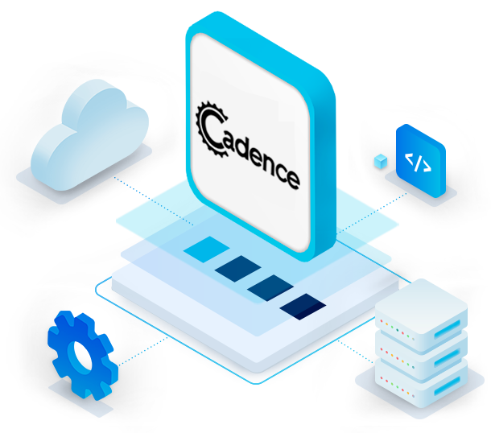

# Instafood: Cadence Workflow Versioning Cookbook



## Introduction

### Who is this cookbook for?

This cookbook is for developers and engineers of all levels looking to understand how to change workflows in Cadence using the versioning API. 
The recipe in this book provides *"Hello World!"* type examples based on simple scenarios and use cases.

### What you will learn

How to setup a simple Cadence application which implements workflow versioning on Instaclustr's Managed Service Platform.

### What you will need

- An account on Instaclustr’s managed service platform (sign up for a free trial using the
  following [signup link](https://console2.instaclustr.com/signup))
- Basic Java 11 and Gradle installation
- IntelliJ Community Edition, Visual Studio Code or any other IDE with Gradle support
- Docker (optional: only needed to run Cadence command line client)

### What is Cadence?

A large number of use cases span beyond a single request-reply, require tracking of a complex state, respond to asynchronous events, and communicate to external unreliable dependencies. The usual approach to building such applications is a hodgepodge of stateless services, databases, cron jobs, and queuing systems. This negatively impacts developer productivity as most of the code is dedicated to plumbing, obscuring the actual business logic behind a myriad of low-level details.

Cadence is an orchestration framework that helps developers write fault-tolerant, long-running applications, also known as workflows. In essence, it provides a durable virtual memory that is not linked to a specific process or host, and is able to rebuild application state by replaying individual steps. This includes function stacks, with local variables across all sorts of host and software failures. This allows you to write code using the full power of a programming language while Cadence takes care of durability, availability, and scalability of the application.

## What is workflow versioning?

Cadence's core abstraction is a fault-oblivious stateful **workflow**. Workflow definitions are built by combining fully deterministic code, and calls to external services using the **activities** interface, to define a replayable, fault tolerant workflow.

Over time, it will become neccesary to modify the workflow, or activity code, when requirements change or interfaces are updated. This can introduce problems for workflows that are currently running.

How do we introduce changes that both satisfy our new requirements and do not introduce non-deterministic changes for workflows that are currently executing?

Cadence supports this with the **versioning api**.

### Cadence's state recovery and determinisim requirement

Before we can understand how versioning is implemented, we must first understand the most powerful feature that Cadence offers: **fault tolerant workflow execution**.

In order to deliver that functionality, Cadence must be able to recover a workflow process that has failed mid-execution, and continue execution as if no problem has occured.

So how does it do this? With a combination of re-executing workflow code and persisting the result of activity calls.

Lets consider a simple example workflow with 3 activity calls.

```java
    Result1 r1 = activity.step1();
    r1.field = r1.field + 1;

    // possible crash here!

    Result2 r2 = activity.step2(r1);
    r2.field = r2.field - 1;

    Result3 r3 = activity.step3(r2);

    return r3;
```

Now lets imagine our workflow code is being executed, and the worker process crashes after step 1 completes, but before step 2 executes.

When a new Cadence worker comes online, it will execute the workflow from the start. When encountering a call to an activity, Cadence first checks to see if there is an event and result in the history table, and if there is, will instantly return that result to the workflow worker.

If we return to our example, the workflow will immediately progress to step 2, having restored the history in the workflow, and continue execution.


### Why do we need deterministic code?

In our previous example, imagine what would happen if our recovering workflow code did not execute the activities in the same order as they did the first time.

```java
    Result1 r1 = activity.step1();
    r1.field = r1.field + 1;

    Result2 r2 = null;
    boolean skipStep2 = random.nextInt(10) < 5;
   
    if (!skipStep2) {
      r2 = activity.step2(r1);
      r2.field = r2.field - 1;
    }

    // possible crash here!

    Result3 r3 = activity.step3(r2);

    return r3;
```

If our workflow code was not deterministic, instead of executing activities *1-2-3*, we might have some code that calls activity 3 without calling activity 2, *1-3*, and this would change the value of the parameter being passed.

How can Cadence recover a workflow which may execute activities in different order or calculate different values every iteration? Short answer, it can't.

If our non-deterministic workflow were to fail and a worker started to recover it, when Cadence encounters a call to an activity that isn't in the history it would throw an exception.

## Workflow versioning explained

So now we understand how Cadence persists activity results, and how it can use the event history to recover a failed worker process.
We also understand that our workflow code must be deterministic, otherwise the workflow is not reliably recoverable.

This leaves us with a problem, what do we do when we **need** to update our workflow code with changes that will make *existing* workflows behave non-deterministically?

Thankfully, Cadence has support for this.

### Updated example

Lets update our example workflow in response to a new requirement:

```diff
    Result1 r1 = activity.step1();
    r1.field = r1.field + 1;

-   Result2 r2 = activity.step2(r1);
+   Result2 r2 = activity.updatedStep2(r1);
    r2.field = r2.field - 1;

    Result3 r3 = activity.step3(r2);

    return r3;
```

We have replaced step 2 with an updated activity call and we want to deploy it, but active workflows will not be able replay history with the newly updated workflow. When Cadence encounters the new activity call, it will throw an exception.

With the Cadence SDK, we can introduce branching logic using the *workflow.getVersion* procedure call.

```java
    Result1 r1 = activity.step1();
    r1.field = r1.field + 1;

    Result r2 = null;
    int version = Workflow.getVersion("step2Updated", Workflow.DEFAULT_VERSION, 1);

    if (version == Workflow.DEFAULT_VERSION) {
      // previous code path
      r2 = activity.step2(r1);
      r2.field = r2.field - 1;
    }
    else {
      // new code path
      r2 = activity.alternateStep2(r1);
    }
    
    Result3 r3 = activity.step3(r2);

    return r3;
```

Our new workflow code uses *workflow.getVersion* to determine the version of the "step2Updated" feature. Then we can decide if it should execute the old or new code paths.

How does this work for workflows that started executing before the version check was implemented?

First, lets break down the 3 parameters in this call:

1. the *changeId*, a unique identifier that represents the change made.
2. *minSupported* the lowest version supported by this workflow. In our example, *Workflow.DEFAULT_VERSION*.
3. *maxSupported* the highest version supported. In our example, 1.

When a workflow encounters this call, it will check the version history for the *changeId* and then evaluates the following scenarios:

1. If we are replaying history, due to a worker recovery, and we encounter *workflow.getVersion* for the first time - Record the *minSupported* value and return it.

    - Cadence has correctly identified that a new version has been introduced, and our inflight workflow execution didn't originally support it, so it returns the minimal value.

2. If we are executing this new workflow for the first time - Record the *maxSupported* value and return it.

    - New instances of a workflow will always return the highest available value for *workflow.getVersion* calls.

3. If there is an existing entry in the history, return the recorded value.

    - Additional version updates will not impact in-flight workflows, the version they recorded the first time will always be the same.

#### Making additional changes

*workflow.getVersion* can support multiple updates. We can increase the *maxSupported* value when we add additional changes and introduce even more branching paths to our workflow code.

```java
    Result1 r1 = activity.step1();
    r1.field = r1.field + 1;

    Result r2 = null;
    int version = Workflow.getVersion("step2Updated", Workflow.DEFAULT_VERSION, 2);

    if (version == Workflow.DEFAULT_VERSION) {
      // initial code path
      r2 = activity.step2(r1);
      r2.field = r2.field - 1;
    }
    else if (version == 1) {
      // second version code path
      r2 = activity.alternateStep2(r1);
    }
    else {
      // newest code path
      r2 = activity.secondAlternateStep2(r1);
    }
    
    Result3 r3 = activity.step3(r2);

    return r3;
```

Eventually, all the workflows running the old logic will complete, and we can consider them no long supported. In this case we can update the *minSupported* value, and then we can remove the workflow branch that supported that version.

```java
    Result1 r1 = activity.step1();
    r1.field = r1.field + 1;

    Result r2 = null;
    int version = Workflow.getVersion("step2Updated", 1, 2);

    if (version == 1) {
      // second version code path
      r2 = activity.alternateStep2(r1);
    }
    else {
      // newest code path
      r2 = activity.secondAlternateStep2(r1);
    }
    
    Result3 r3 = activity.step3(r2);

    return r3;
```

#### Conclusion

Phew! Our workflow has been updated, and it remains deterministic. The first time we encounter any version check, the returned value is persisted.
If we ever replay the history, the value will always remain the same and we can build our workflow code around that guarantee.

### Instafood Brief

Instafood is an online app-based meal delivery service. Customers can place an order for food from their favorite local restaurants via Instafood’s mobile app. Orders can be for pickup or delivery. If delivery is chosen, Instafood will organize to have one of their many delivery drivers pickup the order from the restaurant and deliver it to the customer. Instafood provides each restaurant a kiosk/tablet which is used for communication between Instafood and the restaurant. Instafood notifies the restaurant when an order is placed, and then the restaurant can accept the order, provide an ETA, mark it as ready, etc. For delivery orders, Instafood will coordinate to have a delivery driver pick up based on the ETA.

## Use Case Example: Instafood courier integration

In order to see workflow versioning in action, we'll be updating our Instafood workflow with new functionality.

Our Instafood application dispatches couriers when the customer selects home delivery for their order. For the last few months, customers have been requesting GPS tracking for their couriers to achieve feature parity with our competitors.

The team responsible for courier integration has been working hard and has finally delivered GPS tracking! It's being offered as an API that accepts the restaurant and delivery address as parameters to register the trip. Once registered, the GPS tracking is delivered by a separate process outside the scope of this article.

``` java
  boolean registerDeliveryGPSTracking(String pickupLocation, String deliveryLocation);
```

Now we can integrate it into our *CourerDeliveryWorkflow*, but we can't just add the functionality and deploy the new workflow for all the reasons we just learnt. Any existing workflow that is recovered or has its history replayed will fail.

So, we will use the versioning API to add a version check for our new feature into *CourerDeliveryWorkflow*

``` java
  // Added new GPS tracking functionality
  int workflowVersion = Workflow.getVersion("GPSTrackingSupported", Workflow.DEFAULT_VERSION, 1);
  if (workflowVersion >= 1) {
      courierGPSActivities.registerDeliveryGPSTracking(courierDeliveryJob.getRestaurant().toString(), courierDeliveryJob.getAddress());
  }
```

New workflow instances will be able to register for GPS tracking and the customer will receive updates, and existing workflows will skip over this new functionality if they are being replayed.

## Setting up Instafood Project

In order to run the sample project yourself you’ll need to set up a Cadence cluster. We’ll be using Instaclustr’s Managed Service platform to do so.

### Step 1 - Creating Instaclustr Managed Clusters

A Cadence cluster requires an Apache Cassandra® cluster to connect to for its persistence layer. In order to set up both Cadence and Cassandra clusters we’ll follow ["Creating a Cadence Cluster" documentation.](https://www.instaclustr.com/support/documentation/cadence/getting-started-with-cadence/creating-a-cadence-cluster/)

By using Instaclustr platform, the following operations are handled automatically for you:

- Firewall rules will automatically get configured on the Cassandra cluster for Cadence nodes.
- Authentication between Cadence and Cassandra will get configured, including client encryption settings.
- The Cadence default and visibility keyspaces will be created automatically in Cassandra.
- A link will be created between the two clusters, ensuring you don’t accidentally delete the Cassandra cluster before
  Cadence.
- A Load Balancer will be created. It is recommended to use the load balancer address to connect to your cluster.

### Step 2 - Setting up Cadence Domain

Cadence is backed by a multi-tenant service where the unit of isolation is called a domain. In order
to get our Instafood application running we first need to register a domain for it.

1. In order to interact with our Cadence cluster, we need to install its command line interface client.

  **macOS**

  If using a macOS client the Cadence CLI can be installed with Homebrew as follows:

  ```bash
  brew install cadence-workflow
  # run command line client
  cadence <command> <arguments>
  ```

  **Other Systems**

  If not, the CLI can be used via Docker Hub image `ubercadence/cli`:

  ```bash
  # run command line client
  docker run --network=host --rm ubercadence/cli:master <command> <arguments>
  ```

  For the rest of the steps we'll use `cadence` to refer to the client.

2. In order to connect, it is recommended to use the load balancer address to connect to your cluster. This can be found at the top of the
   *Connection Info* tab, and will look like this: "ab-cd12ef23-45gh-4baf-ad99-df4xy-azba45bc0c8da111.elb.us-east-1.amazonaws.com". We'll call this the <cadence_host>.

3. We can now test our connection by listing current domains:

   ```bash
   cadence --ad <cadence_host>:7933 admin domain list
   ```

4. Add `instafood` domain:

   ```bash
   cadence --ad <cadence_host>:7933 --do instafood domain register
   ```

5. Check it was registered accordingly:

   ```bash
   cadence --ad <cadence_host>:7933 --do instafood domain describe
   ```

### Step 3 - Run Instafood Sample Project

1. Clone Gradle project
   from [Instafood project git repository](https://github.com/instaclustr/cadence-cookbooks-instafood).

2. Open property file at `instafood/src/main/resources/instafood.properties` and replace `cadenceHost` value with your load balancer address:

    ```properties
    cadenceHost=<cadence_host>
    ```

3. Run the megaburgers API:

    ```bash
    cadence-cookbooks-instafood/megaburgers$ ./gradlew run
    ```

4. You can now run the app by  

    ```bash
    cadence-cookbooks-instafood/instafood$ ./gradlew run
    ```

    or executing *InstafoodApplication* main class from your IDE:

    

5. Check it is running by looking into its terminal output:

   

## Running a Happy-Path Scenario

To wrap-up, let’s run a whole order scenario. This scenario is part of the test suite included with our sample project. The only requirement is running both Instafood and MegaBurger server as described in the previous steps. This test case describes a client ordering through Instafood MegaBurger’s new *Vegan Burger* for pick-up:

Let's start by running the server. This can be accomplished by running

  ```bash
  cadence-cookbooks-instafood/instafood$ ./gradlew test
  ```

or *InstafoodApplicationTest* from your IDE

```java
class InstafoodApplicationTest {

    // ...

    @Test
      public void givenAnOrderWithDeliveryItShoulBeSentToMegaBurgerAndDeliveredByACourierAccordingly() {
          FoodOrder order = new FoodOrder(Restaurant.MEGABURGER, "vegan burger", 2, "+54 112343-2324",
                          "Díaz velez 433, La lucila", false);

          // Client orders food
          WorkflowExecution workflowExecution = WorkflowClient.start(orderWorkflow::orderFood, order);

          // Wait until order is pending Megaburger's acceptance
          await().until(() -> OrderStatus.PENDING.equals(orderWorkflow.getStatus()));

          // Megaburger accepts order and sends ETA
          megaBurgerOrdersApiClient.updateStatusAndEta(getLastOrderId(), "ACCEPTED", 15);

          // Wait until order is accepted and we have an ETA
          await().until(() -> OrderStatus.ACCEPTED.equals(orderWorkflow.getStatus()));
          await().until(() -> orderWorkflow.getEtaInMinutes() != -1);

          // Megaburger marks order as ready
          megaBurgerOrdersApiClient.updateStatus(getLastOrderId(), "READY");

          await().until(() -> getOpenCourierDeliveryWorkflowsWithParentId(workflowExecution.getWorkflowId())
                          .size() != 0);
          String courierDeliveryWorkflowId = getOpenCourierDeliveryWorkflowsWithParentId(
                          workflowExecution.getWorkflowId()).get(0)
                          .getExecution().getWorkflowId();
          CourierDeliveryWorkflow courierDeliveryWorkflow = workflowClient.newWorkflowStub(
                          CourierDeliveryWorkflow.class,
                          courierDeliveryWorkflowId);

          // Courier accepts order
          courierDeliveryWorkflow.updateStatus(CourierDeliveryStatus.ACCEPTED);
          await().until(() -> OrderStatus.COURIER_ACCEPTED.equals(orderWorkflow.getStatus()));

          // All new courier workflows should support GPS tracking, since this is a new
          // job it will return true
          assertTrue(courierDeliveryWorkflow.courierSupportsGPSTracking());

          // Courier picked up order
          courierDeliveryWorkflow.updateStatus(CourierDeliveryStatus.PICKED_UP);
          // Megaburger marks order as delivered
          megaBurgerOrdersApiClient.updateStatus(getLastOrderId(), "RESTAURANT_DELIVERED");

          // Courier delivered order
          courierDeliveryWorkflow.updateStatus(CourierDeliveryStatus.DELIVERED);
          await().until(() -> OrderStatus.COURIER_DELIVERED.equals(orderWorkflow.getStatus()));

          await().until(
                          () -> workflowHistoryHasEvent(workflowClient, workflowExecution,
                                          EventType.WorkflowExecutionCompleted));

      }
}
```

We have 3 actors in this scenario: Instafood, MegaBurger and the Client.

1. The Client sends order to Instafood.
2. Once the order reaches MegaBurger (order status is `PENDING`), MegaBurgers marks it as `ACCEPTED` and sends an ETA.
3. We then have the whole sequence of status updates:
   1. MegaBurger marks order as `COOKING`.
   2. MegaBurger marks order as `READY` (this means it's ready for delivery/pickup).
   3. MegaBurger marks order as `RESTAURANT_DELIVERD`.
4. Since this was an order created as delivery, we now start the Courier workflow to deliver the order
    1. The courier accepts the job - since we now support GPS tracking we can query this support and assert it returns true
    2. Then picks up the order
    3. Finally, the order is delivered
5. Once the order is delivered, our entire workflow is completed.

## Regression testing old workflows

As we mentioned before, our workflow versioning logic is built to ensure legacy and in-flight workflows are not made non-deterministic by adding new functionality.

So how can we test this?

Cadence supports this with the *WorkflowReplayer* class. This class can take the history of a workflow and replay it against the current implementation. Any non-determinism errors will be detected and thrown by the unit test.

The history can be retrieved directly from the Cadence cluster, or loaded from a *json* file, as demonstrated in the following example.

```java
class InstafoodApplicationTest {

  // ...

  @Test
      public void givenCourierWorkflowWhenGpsNotSupportedThenHistoryReplaysCorrectly() throws Exception {
          // We have stored the history for a workflow that was executed before GPS
          // support was added into a file - "resources/history-gps-not-supported.json"

          // We use the workflow replayer to ensure that our legacy workflow can still
          // execute correctly.

          WorkflowReplayer.replayWorkflowExecutionFromResource("history-gps-not-supported.json",
                          CourierDeliveryWorkflowImpl.class);

          // If we did not implement our version check, this method would throw an
          // exception -- try it yourself by editing the CourierDeliveryWorkflowImpl
          // class!
      } 
}
```

## Wrapping Up

In this article we introduced the concept of Cadence workflow versioning, and went into a bit of detail explaining how and why it works the way it does. We also showed you how to get a Cadence cluster running with our Instaclustr platform and how easy it is to get an application connect to it. If you’re interested in Cadence and want to learn more about it, you may read about other use cases and documentation at [Cadence workflow - Use cases](https://cadenceworkflow.io/docs/use-cases/).
